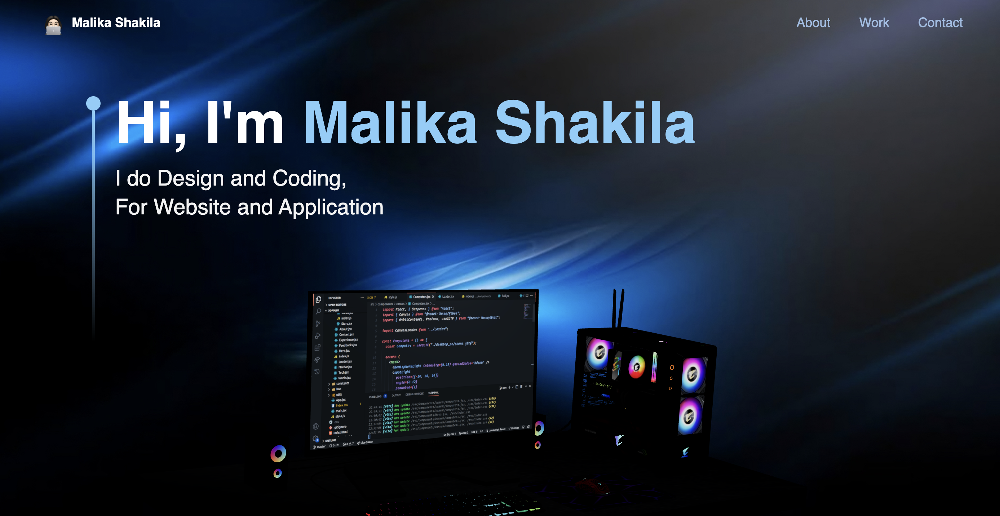

# 🚀 Personal Portfolio - Malika Shakila

Halo! Saya baru saja menyelesaikan project **Portfolio Website** ini.  
Website ini dibuat menggunakan **Three.js**, **React.js**, dan **TypeScript**.

Tampilan utama website:

---

## 🛠 Teknologi yang Digunakan

  
  
  

- **Three.js** – Untuk efek visual 3D di website
- **React.js** – Untuk membangun struktur komponen website
- **TypeScript** – Untuk membuat code lebih aman dan terstruktur

---

## 📄 Fitur Utama

- Landing page interaktif dengan efek visual 3D
- Navigasi halaman (About, Work, Contact)
- Responsive di berbagai device
- Smooth scrolling dan animasi yang halus

---

## 📬 Kontak

Kalau ingin berdiskusi atau bekerja sama, silakan hubungi saya melalui:
- Email: `malikashakila16@gmail.com`
- LinkedIn: [Malika Shakila](https://linkedin.com/in/malikashakila)

---

⭐ Feel free to star repo ini jika kamu suka project ini!
